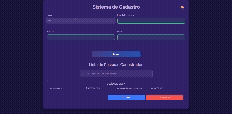

# 👥 People Registry - LocalStorage

<div align="center">


*A modern, accessible, and responsive contact management system built with vanilla JavaScript*

Desenvolvido por [Gerson Ramos](https://github.com/gersonlramos)

</div>

---

## 📋 Table of Contents

- [About](#-about-the-project)
- [Features](#-features)
- [Demo](#-demo)
- [Getting Started](#-getting-started)
- [Usage](#-usage)
- [Architecture](#-architecture)
- [Technologies](#-technologies)
- [Accessibility](#-accessibility)
- [Browser Support](#-browser-support)
- [Contributing](#-contributing)
- [License](#-license)

## 🎯 About the Project

People Registry is a client-side contact management application that leverages the browser's localStorage for data persistence. Built with modern JavaScript (ES6+), it provides a seamless experience for managing personal contacts with full CRUD operations, real-time search, and comprehensive accessibility features.

### Key Highlights

- **No Backend Required**: Runs entirely in the browser using localStorage
- **Modern JavaScript**: Built with ES6+ modules and modern web standards
- **Accessibility First**: WCAG compliant with full keyboard navigation and screen reader support
- **Brazilian Localization**: Native support for Brazilian date formats and phone numbers
- **Responsive Design**: Works seamlessly across desktop, tablet, and mobile devices

## ✨ Features

### Core Functionality
- ➕ **Add Contacts**: Create new person records with validation
- 👁️ **View Contacts**: Display all contacts in an organized list
- ✏️ **Edit Contacts**: Update existing contact information
- 🗑️ **Delete Contacts**: Remove contacts with confirmation and undo functionality
- 🔍 **Real-time Search**: Filter contacts by name, email, or phone number
- 💾 **Auto-save**: Automatic data persistence with localStorage

### Advanced Features
- 🎨 **Dark/Light Theme**: Toggle between themes with preference saving
- 📱 **Phone Formatting**: Automatic Brazilian phone number formatting
- 📅 **Date Validation**: Brazilian date format (DD/MM/YYYY) with validation
- 🔄 **Duplicate Prevention**: Automatic detection of duplicate emails and phone numbers
- 📤 **Data Export/Import**: Backup and restore functionality
- ⚡ **Real-time Validation**: Live form validation with user feedback
- ♿ **Full Accessibility**: ARIA labels, keyboard shortcuts, and screen reader support

### User Experience
- 🎯 **Search Highlighting**: Visual highlighting of search terms in results
- 📢 **Smart Notifications**: Success, error, and warning messages with actions
- ⏪ **Undo Operations**: Ability to undo deletions
- 🎹 **Keyboard Shortcuts**: Efficient navigation without mouse
- 🌐 **Internationalization**: Portuguese (Brazilian) interface

## 🎬 Demo



*The application in action showing add, edit, delete, and search functionality*

## 🚀 Getting Started

### Prerequisites

- Modern web browser (Chrome 60+, Firefox 55+, Safari 12+, Edge 79+)
- Local web server (for development)

### Installation

1. **Clone the repository**
   ```bash
   git clone https://github.com/gersonlramos/people-registry-localstorage.git
   cd people-registry-localstorage
   ```

2. **Start a local server**
   ```bash
   # Using Python 3
   python -m http.server 8000
   
   # Using Node.js http-server
   npx http-server
   
   # Using PHP
   php -S localhost:8000
   ```

3. **Open in browser**
   ```
   http://localhost:8000
   ```

### Alternative Setup

For simple testing, you can also open `src/index.html` directly in your browser, though a local server is recommended for ES6 modules.

## 📖 Usage

### Basic Operations

1. **Adding a Contact**
   - Fill in the form fields (Name, Birth Date, Phone, Email)
   - All fields are required and validated in real-time
   - Click "Salvar" to save the contact

2. **Searching Contacts**
   - Use the search field to filter by name, email, or phone
   - Search terms are highlighted in results
   - Use Alt+S to quickly focus the search field

3. **Editing a Contact**
   - Click the "Editar" button on any contact card
   - The form will populate with existing data
   - Make changes and click "Atualizar"

4. **Deleting a Contact**
   - Click the "Remover" button on any contact card
   - Confirm the deletion in the modal
   - Use "Desfazer" if you need to undo the deletion

### Keyboard Shortcuts

- `Alt + T`: Toggle dark/light theme
- `Alt + S`: Focus search field
- `Alt + N`: Focus name input (new contact)
- `Escape`: Clear form or search
- `Arrow Keys`: Navigate contact list

### Data Management

- **Export**: Data is automatically backed up and can be exported
- **Import**: Restore data from backup files
- **Validation**: All data is validated before saving
- **Persistence**: Data persists between browser sessions

## 🏗️ Architecture

### Project Structure
```
src/
├── index.html              # Main HTML file
├── style.css              # Styles and responsive design
├── js/
│   ├── main.js            # Application entry point
│   ├── App.js             # Main application class
│   ├── components/        # Reusable UI components
│   │   ├── ConfirmationModal.js
│   │   └── NotificationSystem.js
│   ├── managers/          # Business logic managers
│   │   ├── DataManager.js
│   │   └── ThemeManager.js
│   ├── models/            # Data models
│   │   └── Person.js
│   ├── utils/             # Utility functions
│   │   ├── DataBackup.js
│   │   ├── ErrorHandler.js
│   │   └── PhoneFormatter.js
│   └── tests/             # Unit tests
│       └── Person.test.js
└── images/
    └── Cadastro_Pessoas.gif
```

### Design Patterns
- **Factory Pattern**: Used for creating Person instances with validation
- **Module Pattern**: ES6 modules for clean code organization
- **Observer Pattern**: Event-driven architecture for UI updates
- **Strategy Pattern**: Different validation strategies for different field types

### Error Handling
- Comprehensive error boundary system
- User-friendly error messages
- Graceful degradation for unsupported features
- Performance monitoring and logging

## 🛠️ Technologies

### Frontend
- **HTML5**: Semantic markup with accessibility features
- **CSS3**: Modern styling with CSS Grid and Flexbox
- **JavaScript ES6+**: Modern JavaScript with modules, classes, and async/await

### Browser APIs
- **localStorage**: Client-side data persistence
- **Intersection Observer**: Performance optimizations
- **Performance API**: Monitoring and analytics
- **Web Components**: Future-ready component architecture

### Development Tools
- **ESLint**: Code quality and consistency
- **Prettier**: Code formatting
- **Jest**: Unit testing framework

## ♿ Accessibility

This application is built with accessibility as a first-class citizen:

### WCAG 2.1 AA Compliance
- ✅ Keyboard navigation for all functionality
- ✅ Screen reader compatibility
- ✅ High contrast themes
- ✅ Focus management and visual indicators
- ✅ Semantic HTML with proper ARIA labels
- ✅ Alternative text for images
- ✅ Consistent navigation patterns

### Assistive Technology Support
- **Screen Readers**: NVDA, JAWS, VoiceOver compatible
- **Keyboard Navigation**: Full functionality without mouse
- **Voice Control**: Compatible with voice navigation software
- **High Contrast**: Respects system theme preferences

## 🌐 Browser Support

| Browser | Minimum Version | Notes |
|---------|----------------|-------|
| Chrome | 60+ | Full support |
| Firefox | 55+ | Full support |
| Safari | 12+ | Full support |
| Edge | 79+ | Full support |
| IE | Not supported | ES6 modules required |

## 🧪 Testing

Run the test suite:
```bash
npm test
```

### Test Coverage
- Unit tests for Person model validation
- Integration tests for data persistence
- Accessibility testing with automated tools
- Cross-browser compatibility testing

## 🤝 Contributing

Contributions are welcome! Please feel free to submit a Pull Request.

### Development Setup
1. Fork the repository
2. Create a feature branch (`git checkout -b feature/AmazingFeature`)
3. Commit your changes (`git commit -m 'Add some AmazingFeature'`)
4. Push to the branch (`git push origin feature/AmazingFeature`)
5. Open a Pull Request

### Code Style
- Follow ESLint configuration
- Use meaningful commit messages
- Add tests for new features
- Update documentation as needed

## 📄 License

This project is licensed under the MIT License. See the [LICENSE](LICENSE) file for details.

---

<div align="center">

**[⬆ Back to Top](#-people-registry---localstorage)**

Made with ❤️ by [Gerson Ramos](https://github.com/gersonlramos)

</div>
